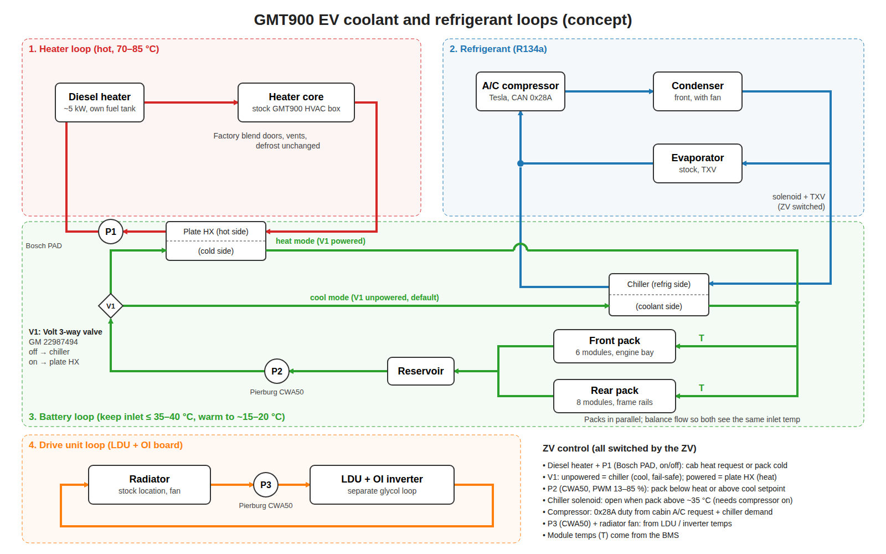

# HVAC and thermal management for the GMT900 EV conversion

Compiled 2026-10-04 from the project's "HVAC" thread. Nothing here has been tested on the truck.
**[inferred]** marks Claude's estimates, not published or measured figures.

## The plan in one paragraph

A Tesla high-voltage electric compressor replaces the belt-driven unit and feeds the stock GMT900 condenser and evaporator (both R134a). A diesel coolant heater plugs into the stock heater core hoses, so the factory blend doors, vents and defrost stay as they are. The same heater can warm the battery through a brazed plate heat exchanger, which keeps the hot heater coolant out of the modules. The battery loop runs through a chiller on the A/C circuit by default. A Chevy Volt 3-way valve switches it to the plate heat exchanger when the pack needs heat. The LDU and OI board stay on their own loop and the stock radiator. The ZombieVerter switches the pumps, heater, chiller solenoid and compressor.

## Files

| File | What's in it |
|---|---|
| [ac-compressor.md](ac-compressor.md) | Tesla compressor variants and part numbers, Gen 2 pinout and CAN protocol (0x28A / 0x223 / 0x233) |
| [heating.md](heating.md) | Diesel coolant heater for the cab and battery, plate heat exchanger sizing and where to buy |
| [battery-cooling.md](battery-cooling.md) | Radiator-only cooling vs adding a chiller, chiller part numbers, sharing the compressor with the cab |
| coolant-loops.png / coolant-loops.svg | Concept diagram of all four loops, with pumps P1–P3 and valve V1 |

## Coolant pumps and battery valve (decided 2026-10-05)

| Loop | Pump | Why |
|---|---|---|
| Heater (P1) | Bosch PAD 0392022010 (Mercedes 0005000386) | Built as a parking-heater pump. On/off, runs straight from the heater's pump output. ~1400 l/h at 0.3 bar, 58 W. ~$135–180 new |
| Battery (P2) | Pierburg CWA50 | PWM speed control from the ZV, so it can run slowly to hold temperature. ~25 L/min at 0.53 bar, 79 W. ~$110–150 new |
| LDU + inverter (P3) | Pierburg CWA50 | Holds flow through the restrictive loop. Runs at full speed if the PWM signal is lost. One spare covers both loops |

**Battery loop valve (V1): Chevy Volt 3-way coolant valve, GM 22987494** (older numbers 22830923 and 22762617), about $60 new from GM parts sites, with aftermarket versions on Amazon. It's a reversible DC motor: 12 V on pin 1 with pin 2 grounded drives it to one port, and reversed polarity drives it to the other. Pins 4–6 are a position sensor (pin 6 is the 5 V reference, pin 5 ground, pin 4 the signal). Drive it with two relays or an H-bridge wired so the **unpowered state selects the chiller**. The ZV cuts motor power once the sensor shows end of travel. Pinout source: [DIY Electric Car Volt valve thread](https://www.diyelectriccar.com/threads/chevy-volt-opel-ampera-3-way-valve.199131/).

**CWA50 PWM** (50–1000 Hz, best under 250 Hz). The ZV must stay out of the 1–12 % bands.

| Duty | Behavior |
|---|---|
| 0–1 % | Stop |
| 1–7 % | Emergency run (~95 % speed) |
| 8–12 % | Stop / error reset |
| 13–85 % | Min to max speed (50 % ≈ 13–15 L/min) |
| 86–97 % | Max speed |
| 98–100 % | Emergency run. A broken PWM wire reads as 100 % through the internal pull-up |

There's no feedback over PWM (diagnostics are on LIN, which the ZV doesn't speak), so the ZV should watch the loop temperatures to catch a dead pump. Bucket-test flow at 3–4 duty settings once the loops are plumbed. Sources: [Tecomotive PWM interface sheet](https://www.tecomotive.com/download/PWMinfo_EN.pdf), [Tecomotive CWA50](https://www.tecomotive.com/en/products/CWA50.html).

## Open items

- Minimum HV voltage for the compressor. The 14-module pack is about 280 V empty, 320 V nominal and 353 V full, and the compressors were tested at 340–368 V.
- Compressor CAN bitrate (probably 500 kbps), and which ZV CAN bus it goes on. The plan is the bus shared with the LDU board, not GMLAN.
- Reading the A/C request from the factory HVAC head unit over low-speed GMLAN. This extends [gm-ecm-spoofing](../gm-ecm-spoofing/).
- Decide whether a radiator alone is enough to cool the battery. That depends on summer climate and whether the truck will DC fast charge.
