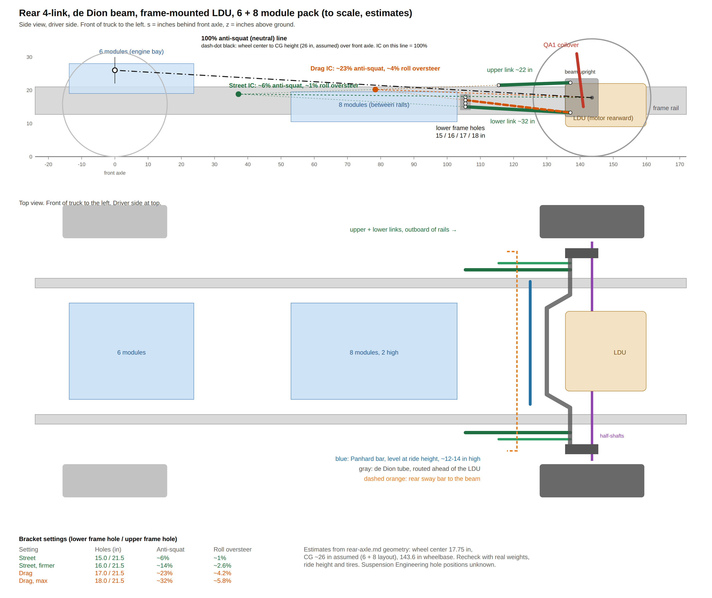

# Rear suspension — GMT900 EV conversion

Compiled 2026-10-04 from the project's rear-axle notes and the "Suspension" thread. Nothing here has been checked on the truck.
**[inferred]** marks Claude's estimates, not published or measured figures.

## The plan in one paragraph

The stock solid rear axle and leaf springs come out. The Tesla LDU (openinverter board) bolts to the frame on the rear axle line, turned 180° so the motor sits behind the axle. A de Dion beam ties the two rear hubs together and is located by a parallel 4-link (Suspension Engineering 2007–2018 Silverado kit as the base) plus a Panhard bar, with QA1 coilovers. Hybrid half-shafts (Tesla inner joint, GMT900 4WD outer joint) drive GMT900 4WD front hubs on the beam ends, which keeps the truck's 6 x 5.5 in wheels and GM brakes. The truck is mostly a street truck with occasional drag racing.

## Files

| File | What's in it |
|---|---|
| [de-dion-and-ldu.md](de-dion-and-ldu.md) | Stock axle facts, de Dion layout, LDU placement, running the LDU reversed, fabrication materials |
| [four-link.md](four-link.md) | 4-link geometry, street and drag bracket settings, neutral line, Panhard, sway bar, coilovers |
| [half-shafts-and-abs.md](half-shafts-and-abs.md) | Half-shaft splines, hybrid shaft plan, ABS tone rings and sensors |
| [weight-and-cg.md](weight-and-cg.md) | Weight distribution with the 6 + 8 module pack, CG height and how to measure it |
| rear-4link.png / rear-4link.svg | To-scale side and top view of the layout |

## Coordinates used throughout

- s = inches behind the front axle centerline, z = inches above the ground, |y| = inches from the truck centerline
- Crew cab short box, wheelbase 143.6 in
- Rear wheel center 17.75 in at model ride height (the truck model has ~35.4 in tires; stock tires are ~31.5 in)

## Open items

- Weigh each axle (and ideally measure CG height) on the stock truck before teardown
- Suspension Engineering kit bracket hole positions (not published; call (559) 348-0200)
- Final ride height and tire size
- Panhard vs Watts packaging around the LDU and the de Dion tube center section (~130 in)
- Axle builder to confirm the hybrid half-shaft (common bar diameter, CV torque capacity)
- Tone ring count and sensor type on the actual truck and on the front hubs
- FEA or an experienced builder to check the beam tube and hub mounts before cutting
